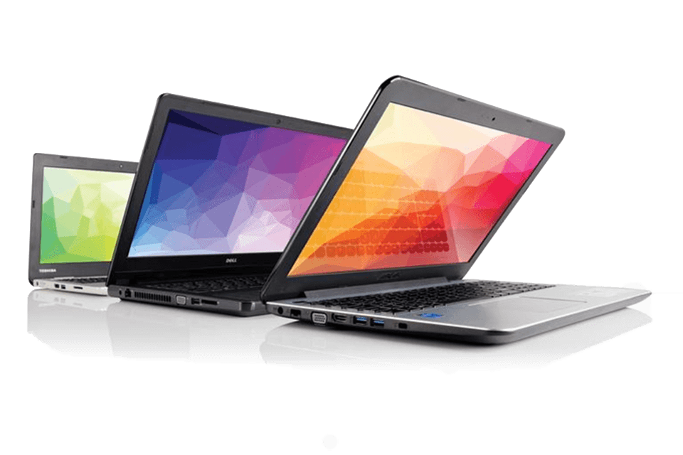

# Usedbrains-E-market-project



An e-commerce website to sell and buy used laptops and components.
built on django

* View the deployed version here:-  [Usedbrains-v1](https://ub-app-v1.herokuapp.com/)

## To Run locally

The project is dockerised, with docker desktop or equivalent installed on the machine, clone the project from the `master` branch and do a,

  ```sh
  docker-compose up
  ```

This will create all needed containers(main and db) with the dependencies in [requirements.txt](./requirements.txt) as per the [docker-compose.yml](./docker-compose.yml), runs the necessary commands in and creates a local development server on on `127.0.0.1:8000`.

## For the deployed version
